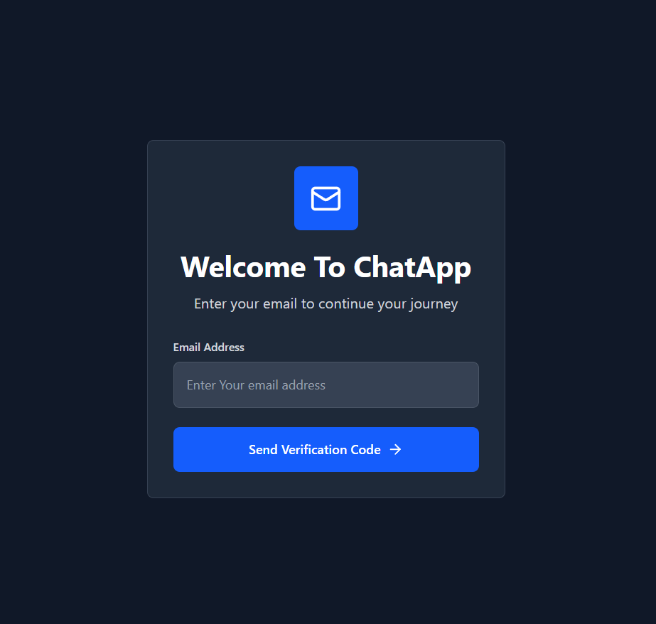
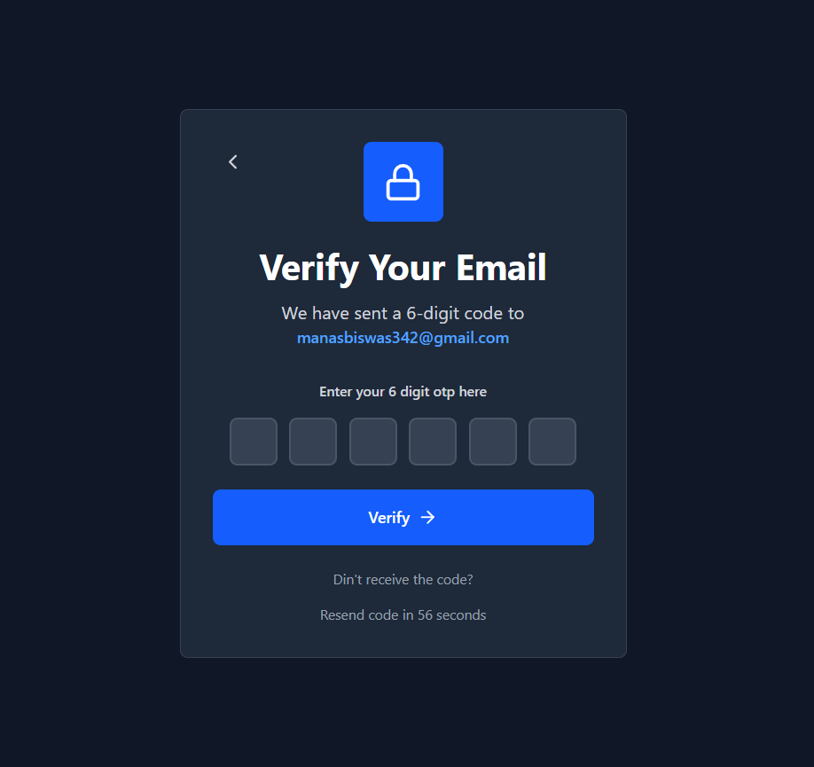
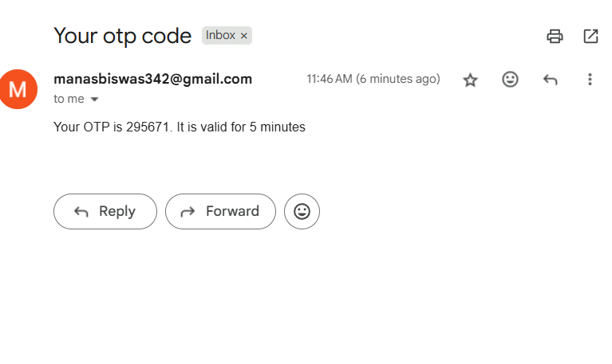
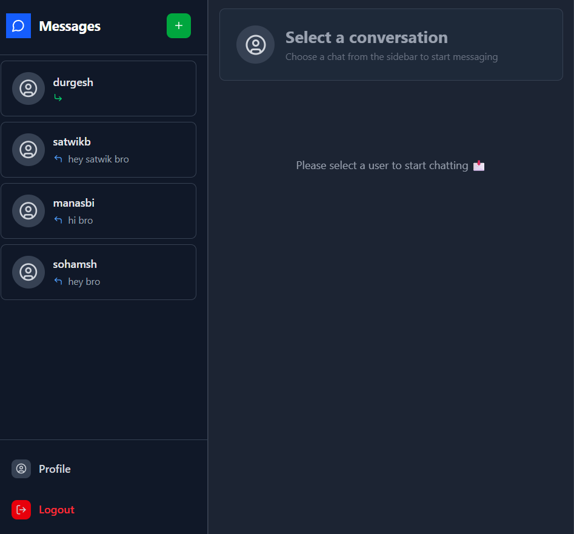
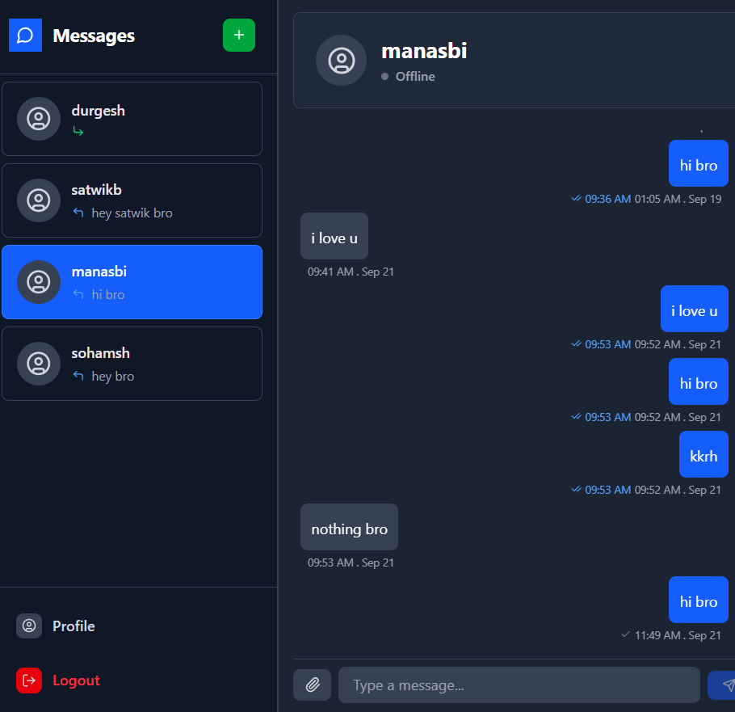
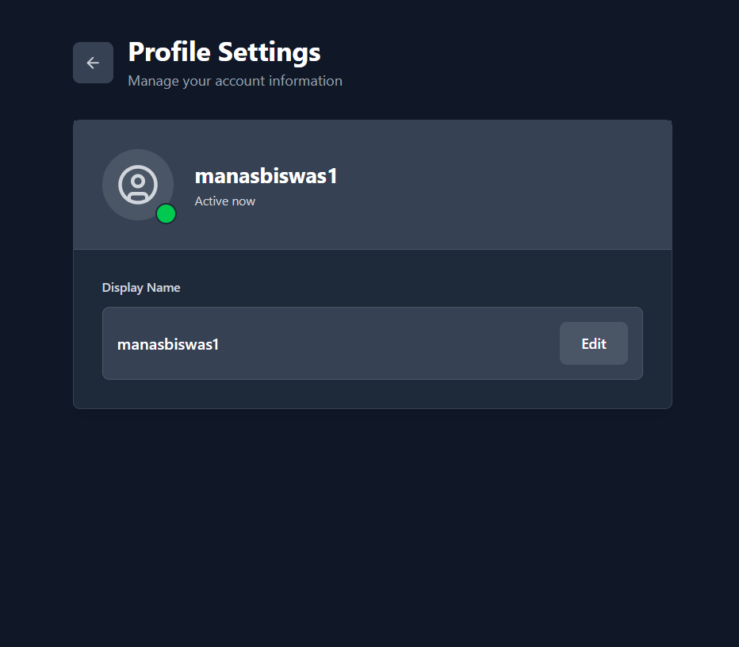

# 💬 Real-Time Chat Application (Frontend)

This is the **frontend** of a **scalable, production-ready real-time chat application** built using the **MERN stack, RabbitMQ, Redis, and microservices architecture**.  

The application is fully **Dockerized**, supports **OTP-based authentication**, and is deployed on **AWS** for production-ready scalability.  

---

## 🌟 Features 

- 🔐 **OTP-based Authentication (Email)**  
- 💬 **Real-time Chat** with **Socket.IO**  
- 📡 **Microservices Communication** via **RabbitMQ**  
- ⚡ **Redis Caching** for fast performance  
- 📱 **Responsive UI** with **React.js (Next.js)**  
- 🟢 **User Presence (Online/Offline Status)**  
- ⌨️ **Real-time Typing Indicators**  
- 👀 **Seen At & Sent At Message Timestamps**  
- ☁️ **AWS Deployment Ready**  
- 🧩 **Scalable & Modular Codebase**  

---

## 📸 Screenshots  

### 🔐 Login & OTP Flow  
  
  
  

### 💬 Chat Interface  
  
  

### 👤 Profile Page  
  

---

## ⚡ Tech Stack

- **Frontend:** React.js, Next.js, TailwindCSS  
- **Backend:** Node.js, Express.js  
- **Database:** MongoDB  
- **Real-time Messaging:** Socket.IO  
- **Message Broker:** RabbitMQ  
- **Cache:** Redis  
- **Deployment:** AWS (Dockerized microservices)  

---

## 🛠️ Getting Started


```bash
1️⃣ Clone the Repository
git clone https://github.com/stud-manasbiswas/CHAT-APP-FRONTEND.git
cd CHAT-APP-FRONTEND

2️⃣ Install Dependencies
npm install

3️⃣ Run Development Server
npm run dev


Frontend will run on 👉 http://localhost:3000
